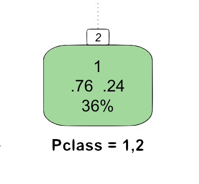

```{r setup, include=FALSE}
knitr::opts_chunk$set(echo = TRUE)
```

## Fancy Plot Node Reference

Each division will contain both positive and
negative training observations. In this node, 76% of the training
instances are positive and 24% are negative. The majority class
thus is positive, or 1, which is signaled by the number 1 on top.

The 36% bit tells you which percentage of the entire training set
passes through this particular node. On each tree level,
these percentages thus sum up to 100%.

Finally, the Pclass = 1,2 bit specifies the feature test on which
this node will be separated next. If the test comes out positive,
the left branch is taken; if it's negative, the right branch is taken.



